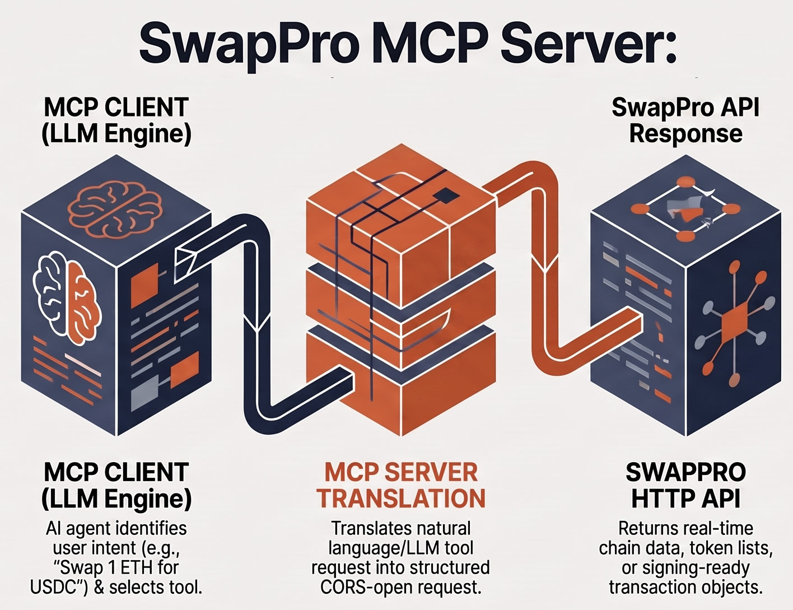

# swapspro MCP Server

A keyless, non-custodial MCP server for the swapspro DEX aggregator. It only
queries swapspro's API and returns raw transaction / deposit payloads — it
never handles private keys, signs, or broadcasts anything.

## Tools

- `discover_chains` — supported blockchain networks
- `discover_tokens(chainId)` — tradable tokens on a chain
- `get_prices` — current price index data
- `get_quote(sellChain, buyChain, sellToken, buyToken, amount, address)` —
  swap route. Response includes `executionShape`:
  - `evm_signable_tx` — same-chain swap, includes `tx` and optional `approvalTx`
  - `cross_chain_deposit` — cross-chain swap, includes `depositAddress` and `memo`



## Setup

```bash
npm install
npm run build
```

Optional: set `SWAPSPRO_AGENT_PASS` to send an `X-SwapsPro-Access` header and lift
default API rate limits.

## Testing

```bash
npx @modelcontextprotocol/inspector node dist/index.js
```

Opens a local web UI to call each tool directly and inspect raw responses.

## Register with Claude Desktop

Add to `claude_desktop_config.json`:

```json
{
  "mcpServers": {
    "swapspro": {
      "command": "node",
      "args": ["/absolute/path/to/swapspro-mcp/dist/index.js"],
      "env": {
        "SWAPSPRO_AGENT_PASS": "optional-agent-pass"
      }
    }
  }
}
```

Restart Claude Desktop after editing the config.
